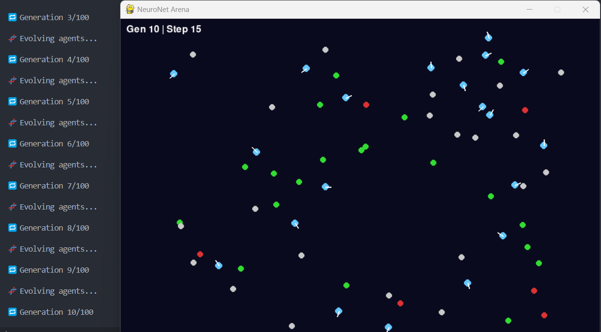

# 🧠 NeuroNet Arena

**NeuroNet Arena** is a fully autonomous AI ecosystem simulator where evolving neural agents battle for survival in a graph-based arena. Each agent is controlled by a lightweight custom neural network that perceives its environment, makes real-time decisions, and adapts across generations via a genetic algorithm.

This project fuses artificial intelligence, evolution strategies, real-time simulation, and game theory — all visualized using Pygame.

---

## 🎮 Live Simulation Demo



---

## 🚀 Features

- 🤖 **Neural Net Agents**: Every agent has a unique feedforward brain that processes environment inputs and outputs directional decisions.
- 🌐 **Graph-Based Arena**: Food, hazards, and neutral zones are randomly distributed in a graph-like space.
- 🧬 **Genetic Evolution**: Top performers clone and mutate their brains into the next generation.
- 🧠 **Handwritten Neural Network**: No PyTorch, no TensorFlow — 100% built-from-scratch network and mutation logic.
- 🖼️ **Pygame Animation**: See agents move, turn, survive, and adapt in real time.
- 📊 **Fitness Dynamics**: Agents gain/lose points by interacting with environmental elements.

---

## 🗂️ Project Structure
```bash
neuronet-arena/ 
├── main.py 
├── img/ │ 
└── gameplay.png 
└── engine/ 
├── simulator.py # Simulation loop 
├── arena.py # Graph-based world generation 
├── agent.py # Agent behavior & logic 
├── brain.py # Custom neural network 
├── evolution.py # Reproduction + mutation 
└── visualizer.py # Real-time Pygame rendering
```


---

## 🧪 How It Works

Agents receive 6-dimensional input vectors:
- Nearby food count
- Nearby hazard count
- Average direction of local nodes
- Current facing direction (cos/sin)

They process these through their neural net and produce a **directional change** as output. Over time, the best brains survive and mutate — leading to stronger decision-making and emergent behavior.

---

## 🔧 Installation

```bash
git clone https://github.com/brettadams0/neuronet-arena.git
cd neuronet-arena
pip install pygame
python main.py
```
---

### 📈 Ideas for Expansion
- Add pheromone trails or memory

- Visualize population fitness trends

- Use reinforcement learning instead of evolution

- Introduce cooperative or hostile agent factions

## 📜 License
MIT License
